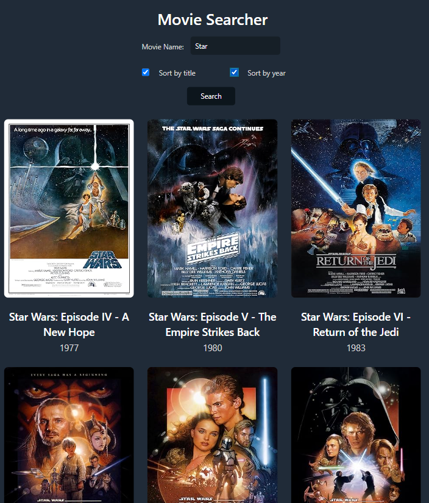

# Movie Searcher
This React App will search for movies, by connecting to an API.

# Objective of the project:
- The result of the API search is a list of movies that matched the requested search, and it shows movie title, year and the poster.
- Movies should are displayed on a responsive grid.
- Using a debounce so when user stops writing the movie gets searched.

# App Development:
- Created custom Hooks, and service (for API fetching) in order to separate logic.
- Applied useMemo, and useCallback to improve app performance.
- Used a debounce (<a href='https://github.com/angus-c/just?tab=readme-ov-file#just-debounce-it>'>just-debounce-it</a>) to make an API call when a timed has passed since the user stop writing a movie to be searched.

## Used APIs:
- https://www.omdbapi.com/
